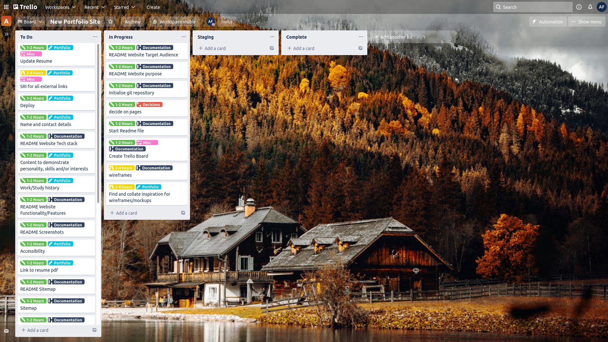

# README

This is the Git repository for my new portfolio site.

## Git Repository

https://github.com/theandrewfulton/new-portfolio-site

## Link to Portfolio

The published portfolio site can be found [here](https://theandrewfulton.com).

While in development, deploys from the staging branch can be found [here](https://staging--tender-saha-025af5.netlify.app/).

While in development, deploys from the main branch can be found [here](https://tender-saha-025af5.netlify.app/).

## Purpose

The purpose of this portfolio site is to showcase my skills,  projects, work history, and to a certain degree my personality to  potential employers, collaborators and clients. It needs to do this in a functional, well laid out, clear and concise manner.

## Target Audience

The target audience for this portfolio site are recruiters and  potential employers, clients and collaborators who may be interested in engaging me professionally in some form.

A second target audience are my friends, family and colleagues who  are interested in following my journey training as a web developer.

## Functionality and Features

The portfolio site contains a link to my Resume as a pdf on the About page and also features a Projects page and a link to my Medium articles, enabling me to showcase my achievements, knowledge and experience in the future, beyond just my Resume.

## User Stories
### Pages

As the Owner I want the copyright year to update automatically so that I don't have to remember to do it

As a Visitor I want links to the Owner's Social Media so that I can connect and engage with them on other platforms

### Home

As a Visitor I want the landing page to be engaging and tell me why I'm visiting so that I am encouraged to explore the site

### About

As a Visitor I want a brief summary of the Owner's skills, interests and work so that I can build a better picture of the individual

As a Recruiter I want to view the Owner's resume so that I can learn more about their work history

### Projects

As the Owner I want to showcase a selection of projects so that I can demonstrate my abilities to viewers, including potential recruiters

### Blog

As the Owner I want visitors to be directed to my articles on Medium so that I can demonstrate my knowledge, experience and perspective on a variety of topics

### Contact

As an Owner I want Visitors to be able to contact me via a webform so that interactions are easier to track and all in one place

As a Visitor I want to contact the author so that I can engage with them

## Tech Stack

## Setup

# Getting Started with Create React App

This project was bootstrapped with [Create React App](https://github.com/facebook/create-react-app).

## Available Scripts

In the project directory, you can run:

### `yarn start`

Runs the app in the development mode.\
Open [http://localhost:3000](http://localhost:3000) to view it in the browser.

The page will reload if you make edits.\
You will also see any lint errors in the console.

### `yarn test`

Launches the test runner in the interactive watch mode.\
See the section about [running tests](https://facebook.github.io/create-react-app/docs/running-tests) for more information.

### `yarn build`

Builds the app for production to the `build` folder.\
It correctly bundles React in production mode and optimizes the build for the best performance.

The build is minified and the filenames include the hashes.\
Your app is ready to be deployed!

See the section about [deployment](https://facebook.github.io/create-react-app/docs/deployment) for more information.

### `yarn eject`

**Note: this is a one-way operation. Once you `eject`, you can’t go back!**

If you aren’t satisfied with the build tool and configuration choices, you can `eject` at any time. This command will remove the single build dependency from your project.

Instead, it will copy all the configuration files and the transitive dependencies (webpack, Babel, ESLint, etc) right into your project so you have full control over them. All of the commands except `eject` will still work, but they will point to the copied scripts so you can tweak them. At this point you’re on your own.

You don’t have to ever use `eject`. The curated feature set is suitable for small and middle deployments, and you shouldn’t feel obligated to use this feature. However we understand that this tool wouldn’t be useful if you couldn’t customize it when you are ready for it.

## Learn More

You can learn more in the [Create React App documentation](https://facebook.github.io/create-react-app/docs/getting-started).

To learn React, check out the [React documentation](https://reactjs.org/).

### Code Splitting

This section has moved here: [https://facebook.github.io/create-react-app/docs/code-splitting](https://facebook.github.io/create-react-app/docs/code-splitting)

### Analyzing the Bundle Size

This section has moved here: [https://facebook.github.io/create-react-app/docs/analyzing-the-bundle-size](https://facebook.github.io/create-react-app/docs/analyzing-the-bundle-size)

### Making a Progressive Web App

This section has moved here: [https://facebook.github.io/create-react-app/docs/making-a-progressive-web-app](https://facebook.github.io/create-react-app/docs/making-a-progressive-web-app)

### Advanced Configuration

This section has moved here: [https://facebook.github.io/create-react-app/docs/advanced-configuration](https://facebook.github.io/create-react-app/docs/advanced-configuration)

### Deployment

This section has moved here: [https://facebook.github.io/create-react-app/docs/deployment](https://facebook.github.io/create-react-app/docs/deployment)

### `yarn build` fails to minify

This section has moved here: [https://facebook.github.io/create-react-app/docs/troubleshooting#npm-run-build-fails-to-minify](https://facebook.github.io/create-react-app/docs/troubleshooting#npm-run-build-fails-to-minify)

## Project Management

Planning this project took place Trello. You can view the Trello Board for the portfolio site [here](https://trello.com/b/wLVhjT7q/new-portfolio-site).

Here is a screenshot of this board, taken during this project:

## Sitemap

## Wireframes

The wireframes for my portfolio site were made in Figma. They can be viewed [here](https://www.figma.com/file/am1oeEiXQoFJjtFyFQZexB/New-Portfolio-Site?node-id=0%3A1).

Colours and fonts were chosen and mocked up using the wireframes for the About page as a starting point.

### Differences between Wireframes and Screenshots